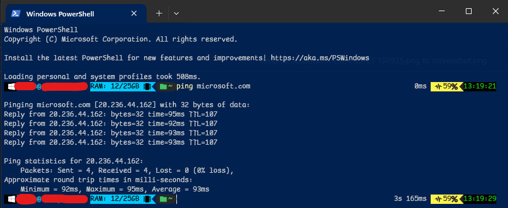

# Oh My Posh - Custom Theme

This script will guide you through the installation of my custom themes. It is currently in a commented state, so please execute it line by line to prevent any errors in UNC paths.

##



## App install
(`user` or `machine` as you see fit)
```PowerShell
winget install JanDeDobbeleer.OhMyPosh --source winget --scope machine --force
```
## Font install
[Preview fonts here](https://www.nerdfonts.com/font-downloads)
```PowerShell
oh-my-posh font install
```
Add a font to the shell. `Cousin Nerd Font Mono` in the example below (`ctrl` + `shift` + `,` to open settings.json)
```json
        "defaults": 
        {
            "elevate": false,
            "opacity": 85,
            "startingDirectory": "c:\\",
            "font":
            {
                "face": "Cousine Nerd Font Mono"
            }
        },
```
Open PowerShell profile
```PowerShell
notepad $PROFILE
```
Add this as the last line and save
```
oh-my-posh init pwsh | Invoke-Expression
```

## Authors

[@upioneer](https://www.github.com/upioneer)

## References

[Oh My Posh](https://ohmyposh.dev/)

[Nerd fonts](https://github.com/ryanoasis/nerd-fonts)
